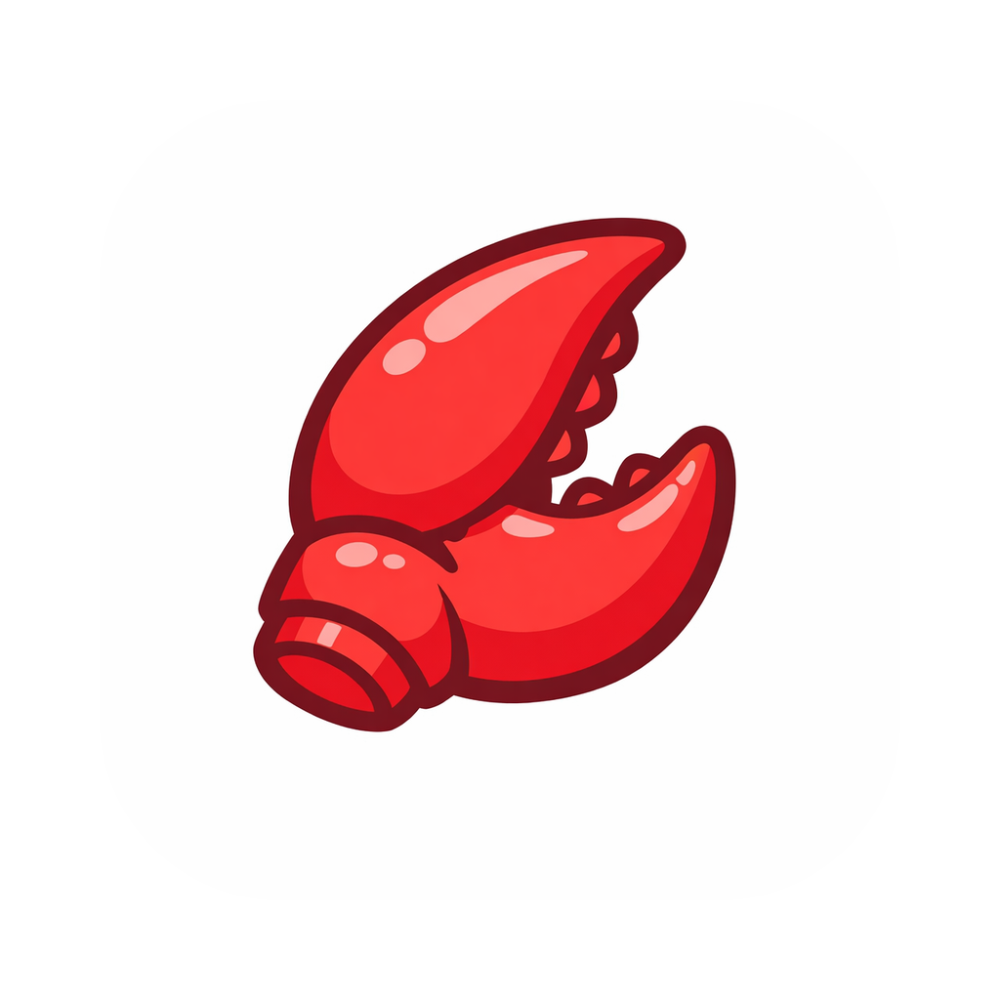

<p align="center">
  
</p>

<h1 align="center">ClawBench</h1>

<p align="center">
  <strong>Integrated AI-Powered Development Assistant for Desktop</strong>
</p>

<p align="center">
  <a href="#installation">Installation</a> ·
  <a href="#features">Features</a> ·
  <a href="#use-cases">Use Cases</a> ·
  <a href="#local-development">Development</a> ·
  <a href="#contributing">Contributing</a>
</p>

<p align="center">
  <a href="./README.zh-CN.md">中文文档</a>
</p>

---

ClawBench is a cross-platform desktop application (macOS & Windows) that brings together AI coding assistants, smart terminals, agent orchestration, and a mini-app marketplace — all in one unified workbench. Developers can leverage built-in AI modules to accelerate daily workflows, or create and share custom mini-apps to automate repetitive tasks, streamlining the entire development lifecycle end-to-end.

## Features

### AI Modules

- **AI Chat** — Multi-model conversations (OpenAI / Claude / Gemini) with streaming, tool calling, MCP integration, and image generation
- **AI Workbench** — Manage Claude Code, Codex, and Gemini CLI coding sessions from a visual interface, with optional Feishu IM remote control
- **AI Terminal** — Terminal + Database dual-mode: local/SSH terminals alongside a multi-database GUI (MySQL, PostgreSQL, MongoDB, SQLite) with an AI assistant
- **AI Agents** — Agent management hub with OpenClaw visual multi-node scenarios and community skills

### Mini-App Marketplace

- **Three resource types**: Apps (Python sub-apps), AI Skills (deployable to Claude/Codex/Gemini workspaces), and Prompts
- **Discover & Install** — Browse, search, install, and update community-contributed resources
- **Create & Publish** — Built-in editors for each resource type (App Editor, Skill Editor, Prompt Editor) with one-click publishing
- **Favorites Bar** — Pin and drag-sort your most-used resources for quick access

### Developer Tools

- **Local Environment** — Detect and install dev tools (Python, Node.js, Git, Docker, and AI CLI tools)
- **Code Editor** — Monaco-based editor integrated into the app creation workflow
- **Multi-language** — Full Chinese and English UI support

### Platform

- Cross-platform: macOS (Intel + Apple Silicon) and Windows
- Auto-update with self-hosted release server
- SQLite / MySQL / PostgreSQL backend support
- JWT authentication and user management

## Installation

Download the latest release for your platform:

| Platform | Download |
|---|---|
| macOS (Universal) | [ClawBench.dmg](https://github.com/mblackcat/clawbench/releases/latest) |
| Windows | [ClawBench-Setup.exe](https://github.com/mblackcat/clawbench/releases/latest) |

> After downloading, open the `.dmg` (macOS) or run the `.exe` installer (Windows) and follow the prompts.

## Use Cases

**Daily AI-Assisted Coding** — Use AI Chat or AI Workbench to get code suggestions, debug issues, or generate boilerplate across multiple AI models without leaving the workbench.

**Database Management** — Connect to MySQL, PostgreSQL, MongoDB, or SQLite databases through the AI Terminal's DB mode. Run queries, browse tables, and get AI-powered SQL suggestions.

**Remote Server Operations** — Open SSH terminals within ClawBench and use the AI assistant to help with server administration, log analysis, and troubleshooting.

**Team Knowledge Sharing** — Package common workflows as AI Skills or Prompts, publish them to the marketplace, and let your team install them with one click.

**Custom Automation** — Write Python mini-apps to automate repetitive tasks (CI triggers, code analysis, data processing) and run them directly from the favorites bar.

**AI Skill Deployment** — Create and deploy AI skills (as SKILL.md files) into Claude Code, Codex, or Gemini CLI workspaces with automatic detection and placement.

## Local Development

### Prerequisites

- Node.js 18+
- Python 3.8+ (for sub-app development)
- Git

### Setup

```bash
# Clone the repository
git clone https://github.com/mblackcat/clawbench.git
cd clawbench

# Install frontend dependencies
cd frontend && npm install

# Install backend dependencies
cd ../backend && npm install
```

### Configuration

```bash
# Set up backend environment
cd backend
cp .env.example .env
# Edit .env — change JWT_SECRET for production use
```

### Running

Start the backend and frontend in two separate terminals:

```bash
# Terminal 1 — Backend API server (port 3001)
cd backend
npm run dev

# Terminal 2 — Electron app with hot reload
cd frontend
npm run dev
```

### Building

```bash
# macOS (.dmg, universal binary)
cd frontend && npm run build:mac

# Windows (.exe installer)
cd frontend && npm run build:win
```

### Testing

```bash
# Backend tests (200+ test cases, SQLite by default)
cd backend && npm test

# Run against MySQL or PostgreSQL
npm run docker:up        # Start MySQL + PostgreSQL containers
npm run test:mysql
npm run test:postgres
```

## Project Structure

```
clawbench/
├── frontend/                 # Electron + React desktop app
│   ├── src/
│   │   ├── main/            # Main process (Node.js services, IPC)
│   │   ├── preload/         # Context bridge (typed window.api)
│   │   └── renderer/        # Renderer (React SPA, Zustand stores)
│   ├── python-sdk/          # Python SDK for sub-apps
│   └── resources/           # App icons
├── backend/                  # API server (Express + TypeScript)
│   ├── src/
│   │   ├── controllers/     # Route handlers
│   │   ├── services/        # Business logic
│   │   ├── repositories/    # Data access layer
│   │   └── database/        # Multi-DB adapter (SQLite/MySQL/PG)
│   └── tests/
└── docs/                     # Documentation
```

## Tech Stack

| Layer | Technologies |
|---|---|
| Desktop Shell | Electron, electron-vite |
| Frontend | React 18, TypeScript, Ant Design v5, Zustand |
| Backend | Node.js, Express, TypeScript |
| Database | SQLite (default), MySQL, PostgreSQL |
| AI Providers | OpenAI, Anthropic Claude, Google Gemini |
| Sub-Apps | Python 3, custom JSON-line protocol |

## Writing a Mini-App

Create a Python sub-app with the built-in SDK:

```python
from clawbench_sdk import ClawBenchApp

class MyApp(ClawBenchApp):
    def run(self) -> None:
        self.emit_output("Starting analysis...", "info")
        self.emit_progress(50.0, "Processing")
        # ... your logic here
        self.emit_result(True, "Done!")

if __name__ == "__main__":
    MyApp.execute()
```

Define parameters in `manifest.json`:

```json
{
  "id": "com.example.my-app",
  "name": "My App",
  "version": "1.0.0",
  "type": "app",
  "entry": "main.py",
  "params": [
    { "name": "target", "type": "path", "label": "Target Directory", "required": true }
  ]
}
```

See the [Python SDK documentation](frontend/python-sdk/) for the full API reference.

## Contributing

Contributions are welcome! Here's how to get started:

1. Fork the repository
2. Create a feature branch (`git checkout -b feature/my-feature`)
3. Commit your changes (`git commit -m 'feat: add my feature'`)
4. Push to the branch (`git push origin feature/my-feature`)
5. Open a Pull Request

Please use [Conventional Commits](https://www.conventionalcommits.org/) for commit messages.

## License

[MIT License with Commons Clause](LICENSE) — free to use, modify, and distribute, but you may not sell the software or offer it as a paid service.

## Acknowledgments

Built with [Electron](https://www.electronjs.org/), [React](https://react.dev/), [Ant Design](https://ant.design/), and powered by AI models from [OpenAI](https://openai.com/), [Anthropic](https://www.anthropic.com/), and [Google](https://ai.google/).
